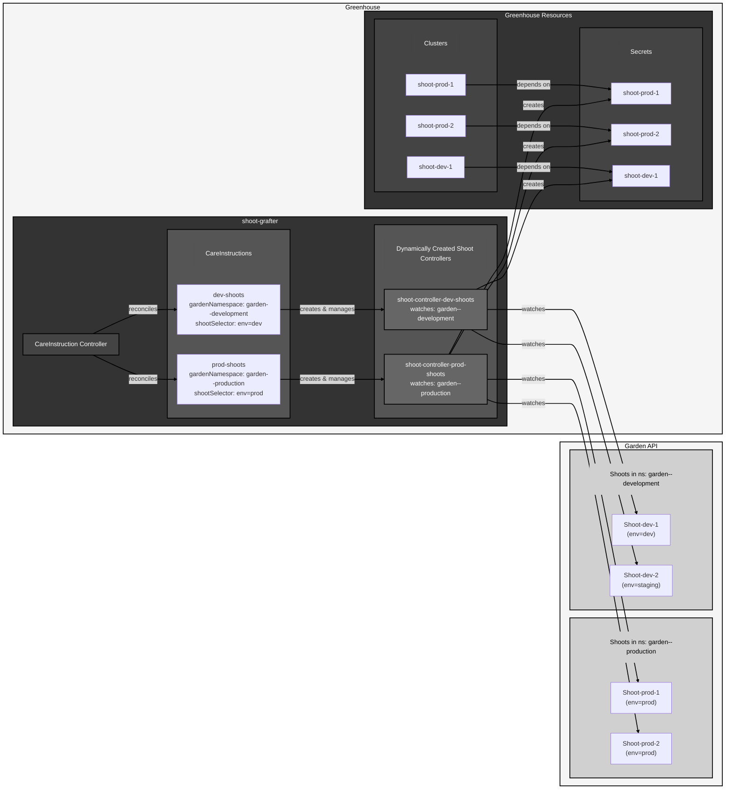

<!--
SPDX-FileCopyrightText: 2026 SAP SE or an SAP affiliate company and Greenhouse contributors

SPDX-License-Identifier: Apache-2.0
-->

[](https://api.reuse.software/info/github.com/cloudoperators/shoot-grafter)

# shoot-grafter

## About this project

**shoot-grafter** is a Kubernetes operator that automates the onboarding of [Gardener](https://gardener.cloud/) Shoots (Kubernetes clusters managed by Gardener) to [Greenhouse](https://github.com/cloudoperators/greenhouse), the cloud operations platform. It bridges the gap between Gardener-managed infrastructure and Greenhouse's centralized cluster management by dynamically discovering and registering Shoots as Greenhouse Clusters.

The name "shoot-grafter" continues Gardener's and Greenhouse's botanical theme: just as a gardener grafts shoots onto rootstock to create robust plants, this operator grafts (connects) Gardener Shoots onto Greenhouse's centralized platform to create fully operational k8s clusters.

This project is part of the [NeoNephos Foundation](https://neonephos.org/).

## What does shoot-grafter do?

shoot-grafter continuously monitors Garden clusters for Shoots matching specific criteria and automatically:

1. **Discovers Shoots**: Watches for Gardener Shoot resources in specified namespaces based on label selectors
2. **Extracts cluster credentials**: Retrieves API server URLs and CA certificates from Shoot resources
3. **Creates Greenhouse Clusters**: Automatically registers discovered Shoots as Greenhouse Cluster resources
4. **Propagates labels**: Transfers specified labels from Shoots to Greenhouse Clusters for consistent organization
5. **Configures OIDC authentication**: Optionally configures OIDC authentication on Shoot clusters to enable Greenhouse authentication
6. **Configures RBAC**: Optionally sets up role-based access control on Shoot clusters for Greenhouse service accounts
7. **Maintains synchronization**: Keeps Greenhouse Cluster resources in sync with their corresponding Shoots

shoot-grafter currently only creates clusters matching Shoots but does not automatically clean up clusters when Shoot labels change or Shoots are deleted. Manual cleanup of Greenhouse Cluster resources is required in these scenarios.

## Architecture



The operator consists of two main controllers:

### CareInstruction Controller

The `CareInstruction` is the primary Custom Resource Definition (CRD) that configures how shoot-grafter operates. Each CareInstruction:

- Defines which Garden cluster to monitor (via kubeconfig secret or Greenhouse Cluster reference)
- Specifies which namespace to watch for Shoots
- Declares label selectors to filter which Shoots to onboard
- Configures label propagation and additional metadata
- Manages the lifecycle of dynamically created Shoot controllers

### Shoot Controller

For each CareInstruction, a dedicated Shoot controller is dynamically created and runs in its own manager. This controller:

- Watches Shoot resources in the specified Garden cluster namespace
- Extracts cluster connection details (API server URL, CA certificate)
- Creates or updates corresponding Secret resources with OIDC configuration
- Generates Greenhouse Cluster resources with appropriate labels
- Optionally configures OIDC authentication on Shoot clusters for Greenhouse access. Also see respective [Greenhouse docs](https://cloudoperators.github.io/greenhouse/docs/user-guides/cluster/oidc_connectivity/) and [Gardener docs](https://gardener.cloud/docs/guides/administer-shoots/oidc-login/#configure-the-shoot-cluster)
- Optionally configures RBAC on the Shoot cluster for Greenhouse access

## Custom Resource: CareInstruction

A `CareInstruction` defines the configuration for onboarding Shoots from a specific Garden cluster.

### Example CareInstruction

```yaml
apiVersion: shoot-grafter.cloudoperators.dev/v1alpha1
kind: CareInstruction
metadata:
  name: production-shoots
  namespace: greenhouse-org
spec:
  # Option 1: Reference a Greenhouse Cluster resource
  gardenClusterName: garden-prod-cluster
  
  # Option 2: Reference a kubeconfig secret directly
  # gardenClusterKubeConfigSecretName:
  #   name: garden-kubeconfig
  #   key: kubeconfig
  
  # Namespace in the Garden cluster to watch
  gardenNamespace: garden-production
  
  # Label selector for Shoots to onboard
  shootSelector:
    matchLabels:
      environment: production
      team: platform
  
  # Labels to propagate from Shoot to Greenhouse Cluster
  propagateLabels:
    - metadata.greenhouse.sap/region
    - greenhouse.sap/owned-by
  
  # Additional labels to add to all created Clusters
  additionalLabels:
    onboarding-source: garden-prod
  
  # Reference to AuthenticationConfiguration ConfigMap (optional)
  authenticationConfigMapName: greenhouse-oidc-config

  # Enable automatic RBAC configuration (default: true)
  enableRBAC: true
```

### CareInstruction Spec Fields

| Field | Type | Required | Description |
|-------|------|----------|-------------|
| `gardenClusterName` | string | No*| Name of the Greenhouse Cluster resource representing the Garden cluster |
| `gardenClusterKubeConfigSecretName` | SecretKeyReference | No* | Reference to a secret containing the kubeconfig for the Garden cluster |
| `gardenNamespace` | string | Yes | Namespace in the Garden cluster where Shoots are located |
| `shootSelector` | LabelSelector | No | Label selector to filter which Shoots to onboard (if omitted, all Shoots in namespace are selected). |
| `propagateLabels` | []string | No | List of label keys to copy from Shoot to Greenhouse Cluster |
| `additionalLabels` | map[string]string | No | Additional labels to add to all created Greenhouse Clusters |
| `authenticationConfigMapName` | string | No | Name of ConfigMap in Greenhouse cluster containing AuthenticationConfiguration [(config.yaml with apiserver.config.k8s.io/v1beta1 content)](https://gardener.cloud/docs/guides/administer-shoots/oidc-login/#configure-the-shoot-cluster)|
| `enableRBAC` | bool | No | When false, skips automatic RBAC setup on Shoot clusters (default: true‚) |

*Note: Either `gardenClusterName` or `gardenClusterKubeConfigSecretName` must be provided (priority: kubeconfig secret > cluster name)

### CareInstruction Status

The CareInstruction status provides real-time information about the onboarding process:

```yaml
status:
  statusConditions:
    conditions:
      - type: Ready
        status: "True"
        reason: Ready
        message: CareInstruction is ready
      - type: GardenClusterAccessReady
        status: "True"
        reason: GardenClusterAccessReady
      - type: ShootControllerStarted
        status: "True"
        reason: Started
      - type: ShootsReconciled
        status: "True"
        reason: Reconciled
        message: All shoots and clusters are reconciled
  clusters:
    - name: shoot-cluster-1
      status: Ready
    - name: shoot-cluster-2
      status: Ready
    - name: shoot-cluster-3
      status: Failed
      message: couldn't get current server API group list: the server has asked for the client to provide credentials
  totalShootCount: 3
  createdClusters: 2
  failedClusters: 1
```

**Status Fields**:

- `Ready`: Overall readiness of the CareInstruction (derived from sub-conditions)
- `GardenClusterAccessReady`: Indicates whether the Garden cluster is accessible
- `ShootControllerStarted`: Shows if the dynamic Shoot controller has been started
- `ShootsReconciled`: Reports whether all targeted Shoots have been successfully onboarded
- `clusters`: Detailed list of all clusters managed by this CareInstruction with their individual status (Ready/Failed) and optional message
- `totalShootCount`: Total number of Shoots matched by the selector
- `createdClusters`: Number of Greenhouse Clusters created by this CareInstruction
- `failedClusters`: Number of Greenhouse Clusters that are not ready

## Usage Examples

### Example 1: Onboard all Shoots in a namespace

```yaml
apiVersion: shoot-grafter.cloudoperators/v1alpha1
kind: CareInstruction
metadata:
  name: all-dev-shoots
  namespace: greenhouse-dev
spec:
  gardenClusterName: dev-garden
  gardenNamespace: garden--dev
```

### Example 2: Onboard Shoots with specific labels

```yaml
apiVersion: shoot-grafter.cloudoperators/v1alpha1
kind: CareInstruction
metadata:
  name: production-critical
  namespace: greenhouse-prod
spec:
  gardenClusterName: prod-garden
  gardenNamespace: garden--production
  shootSelector:
    matchLabels:
      environment: production
  propagateLabels:
    - metadata.greenhouse.sap/region
    - greenhouse.sap/owned-by
  additionalLabels:
    monitoring: enabled
    backup: daily
```

### Example 3: Using matchExpressions for advanced selection

```yaml
apiVersion: shoot-grafter.cloudoperators/v1alpha1
kind: CareInstruction
metadata:
  name: multi-env-shoots
  namespace: greenhouse
spec:
  gardenClusterName: my-garden
  gardenNamespace: garden--myproject
  shootSelector:
    matchLabels:
      shoot.gardener.cloud/status: "healthy"
    matchExpressions:
      - key: environment
        operator: In
        values:
          - staging
          - production
      - key: owned-by
        operator: Exists
  propagateLabels:
    - metadata.greenhouse.sap/region
    - metadata.greenhouse.sap/environment
    - greenhouse.sap/owned-by
  additionalLabels:
    onboarding-method: shoot-grafter
```

### Example 4: Configuring OIDC Authentication

This example shows how to configure OIDC authentication on Shoots to enable Greenhouse authentication:

```yaml
apiVersion: shoot-grafter.cloudoperators/v1alpha1
kind: CareInstruction
metadata:
  name: oidc-enabled-shoots
  namespace: greenhouse-prod
spec:
  gardenClusterName: prod-garden
  gardenNamespace: garden--production
  shootSelector:
    matchLabels:
      enabled-oidc: "true"
  authenticationConfigMapRef: greenhouse-oidc-config
  propagateLabels:
    - metadata.greenhouse.sap/environment
```

The referenced ConfigMap should contain an AuthenticationConfiguration:

```yaml
apiVersion: v1
kind: ConfigMap
metadata:
  name: greenhouse-oidc-config
  namespace: greenhouse-prod
data:
  config.yaml: |
    apiVersion: apiserver.config.k8s.io/v1beta1
    kind: AuthenticationConfiguration
    jwt:
    - issuer:
        url: https://oidc.greenhouse.example.com
        audiences:
        - greenhouse
      claimMappings:
        username:
          claim: sub
          prefix: "greenhouse:"
        groups:
          claim: groups
          prefix: "greenhouse:"
```

## Debugging Shoot Reconciliation

shoot-grafter emits Kubernetes events to help you monitor and debug the Shoot onboarding process. Events are associated with the CareInstruction resource.

### View Events for a CareInstruction

To see all events related to a specific CareInstruction:

```bash
# View events in the resource description
kubectl describe careinstruction <careinstruction-name> -n <namespace>

# List all events for a specific CareInstruction
kubectl get events -n <namespace> \
  --field-selector involvedObject.name=<careinstruction-name>

# Filter events by reason
kubectl get events -n <namespace> \
  --field-selector involvedObject.name=<careinstruction-name>,reason=ShootReconciled

# Watch events in real-time
kubectl get events -n <namespace> \
  --field-selector involvedObject.name=<careinstruction-name> \
  --watch
```

### Event Types

shoot-grafter emits the following events during Shoot reconciliation:

#### Normal Events (Successful Operations)

| Event Reason | Description |
|-------------|-------------|
| `ShootReconciled` | Successfully completed reconciliation for a Shoot |
| `SecretCreated` | Created Greenhouse secret with cluster credentials |
| `SecretUpdated` | Updated existing Greenhouse secret with new credentials |
| `ShootDeleted` | Shoot was deleted from the Garden cluster |
| `OIDCConfigured` | Successfully configured OIDC authentication for the Shoot |
| `RBACCreated` | Created RBAC ClusterRoleBinding for Greenhouse ServiceAccount on the Shoot |

#### Warning Events (Issues Requiring Attention)

| Event Reason | Description | Resolution |
|-------------|-------------|------------|
| `APIServerURLMissing` | Shoot doesn't have an external API server URL | Check Shoot status in Garden cluster; ensure Shoot is fully reconciled |
| `CAConfigMapFetchFailed` | Failed to fetch CA certificate ConfigMap | Verify ConfigMap `<shoot-name>.ca-cluster` exists in Garden namespace |
| `CADataMissing` | CA certificate data is empty in ConfigMap | Check ConfigMap data contains valid `ca.crt` entry |
| `SecretOperationFailed` | Failed to create or update Greenhouse secret | Check RBAC permissions and Greenhouse cluster connectivity |
| `OIDCConfigurationFailed` | Failed to configure OIDC authentication on the Shoot | Verify AuthenticationConfigMap exists and contains valid configuration; check Garden cluster connectivity and permissions |
| `ShootClientFetchFailed` | Failed to get Shoot cluster client | Verify Shoot is accessible and kubeconfig is valid; check network connectivity to Shoot cluster |
| `RBACCreationFailed` | Failed to create RBAC ClusterRoleBinding on the Shoot | Check connectivity to Shoot cluster; verify service account has sufficient permissions |

### Event Retention

Kubernetes automatically cleans up events after a TTL period (typically 1 hour by default). This TTL can be configured via the `--event-ttl` flag on the kube-apiserver.

## Support, Feedback, Contributing

This project is open to feature requests/suggestions, bug reports etc. via [GitHub issues](https://github.com/cloudoperators/shoot-grafter/issues). Contribution and feedback are encouraged and always welcome. For more information about how to contribute, the project structure, as well as additional contribution information, see our [Contribution Guidelines](CONTRIBUTING.md).

## Security / Disclosure

If you find any bug that may be a security problem, please follow our instructions at [in our security policy](https://github.com/cloudoperators/shoot-grafter/security/policy) on how to report it. Please do not create GitHub issues for security-related doubts or problems.

## Code of Conduct

We as members, contributors, and leaders pledge to make participation in our community a harassment-free experience for everyone. By participating in this project, you agree to abide by its [Code of Conduct](https://github.com/SAP/.github/blob/main/CODE_OF_CONDUCT.md) at all times.

## Licensing

Copyright 2025 SAP SE or an SAP affiliate company and shoot-grafter contributors. Please see our [LICENSE](LICENSE) for copyright and license information. Detailed information including third-party components and their licensing/copyright information is available [via the REUSE tool](https://api.reuse.software/info/github.com/cloudoperators/shoot-grafter).
